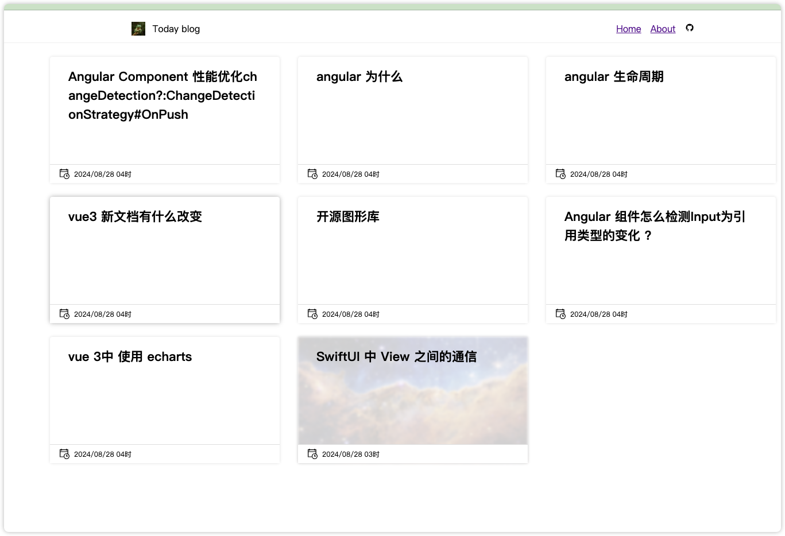
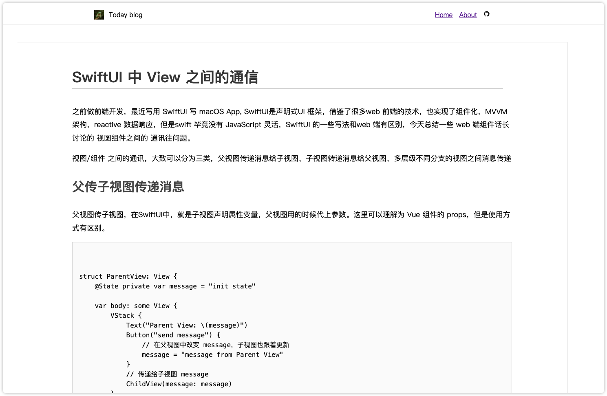

# Notion Database to Nuxt Blog

Use notion database as CMS for your blog.


## Use

clone this repo and modify the env file to your own notion database id and token.

```

VITE_NOTION_TOKEN=""
VITE_DATABASE_ID="12476b6af58e48b896720a8f89"
VITE_API_HOST="https://api.notion.com/v1"

```

## Plan

- [ ] Theme switcher
- [ ] Table of Contents in detail page
- [ ] notion block data render

## Preview





## Reference

- [Notion API](https://developers.notion.com/reference/intro)
- [Postman Notion API](https://www.postman.com/notionhq/)
- [Nuxt.js](https://nuxtjs.org/)


